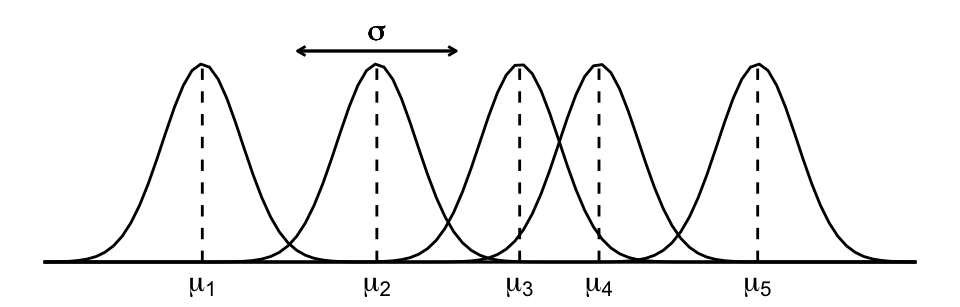

```{r setup, include=FALSE}
options(htmltools.dir.version = FALSE)

library(RefManageR)
library(fontawesome)
library(tidyverse)
library(details)
library(brms)
library(posterior)
library(bayesplot)
library(targets)
library(broom)
library(broom.mixed)
library(tidybayes)
tar_unscript()
```


```{css, echo = FALSE}
.title-slide .remark-slide-number {
  display: none;
}
```

```{r xaringan-extra-all-the-things, echo=FALSE}
library(xaringanExtra)
xaringanExtra::use_xaringan_extra(
  c("tile_view", "panelset", "editable", 
    "animate", "tachyons")
)

xaringanExtra::use_tachyons()

xaringanExtra::use_extra_styles(
  hover_code_line = TRUE,         #<<
  mute_unhighlighted_code = TRUE  #<<
)

xaringanExtra::use_logo("fig/bl_logo.png",
                        link_url = "https://www.lucs.lu.se/bayes/",
                        position=css_position(top = "2em", right = "2em"))
```

```{r xaringan-themer, include=FALSE, warning=FALSE}
library(xaringanthemer)
style_mono_accent(base_color = "#2a3990",
  header_font_google = google_font("Josefin Sans"),
  text_font_google   = google_font("Montserrat", "300", "300i"),
  code_font_google   = google_font("Fira Mono")
)
```

```{targets ilbm-globals, tar_globals = TRUE, include=FALSE}
options(tidyverse.quiet = TRUE)
tar_option_set(packages = c("tidyverse", "posterior", "rstan", "brms", "bayesplot"))
options(mc.cores = parallel::detectCores()-2)
options(clustermq.scheduler="multicore")
```

.h1.f-headline.fw1[
Bayesian Analysis
]

.h2.f-subheadline.lh-title[
and Decision Theory
]
<br><br>
.f1[
Mixed (hierarchical) models
]

.f3[
NAMV005<br>
Lund 2022
]
---
# Course content

|Topic|Format| Date |
|-----|------|------|
| Introduction to Bayesian inference and subjective probability <br> Conjugate models| Review <br> Lecture | 17 Jan 2022 |
| Conjugate models (review and exercises) <br> Modern Bayesian analysis with MCMC | Review <br> Lecture | 24 Jan 2022 |
| Modern Bayesian analysis with MCMC (review and exercises) <br> Hierarchical models | Review <br> Lecture | 31 Jan 2022 |
| Hierarchical models (review and exercises) <br> Decision theory <br> Literature seminar | Review <br> Lecture <br> Seminar | 07 Feb 2022 |

---
# Recap

1. Conjugate models. Globe tossing with beta-binomial model
1. Linear models. Gaussian model assumptions
  - Introduction to `brms` and the first model
  - Peeking under the hood. Our own first program in Stan.
  - Data wrangling and visualization of posterior draws.

--

## Today

1. Mixed models. Repeated measurements / hierarchical data.
1. Pooling. 
1. Normal hierarchical model and beyond.
1. Adding more layers

---
# Mixed models

Up until now we worked under the iid data assumption. Sometimes samples in the data may not be independent because:
+ several measurements were collected from the same individual (repeated measurement data), or
+ surveyed individuals share some characteristics (e.g. group membership): pupils in class, athletes in clubs, citizens in countries, etc.

```{r cherry50_code, message=FALSE, warning=FALSE, error=FALSE}
cherry50 <- read_csv("data/mdsr_cherry50.csv")
cherry50
```

```{targets cherry50, ref.label="cherry50_code", tar_simple=TRUE, include=FALSE}
```

```{r, include=FALSE}
unlink("logs", recursive = TRUE); tar_make()
cherry50 <- tar_read(cherry50)
```

---
# Complete pooling
.pull-left[
```{r, error=FALSE, message=FALSE, warning=FALSE, fig.width=7, fig.height=5}
ggplot(cherry50, aes(x=age, y=time))+
  geom_point()+
  geom_smooth(method = "lm")+
  theme_minimal()
```
]
.pull-right[
Let's fit the simple Bayesian linear model
$$\begin{aligned}Y_i&\sim Normal(\mu_i, \sigma)\\
\mu_i&=\beta_0 + \beta_1X_i
\end{aligned}$$

```{r pooled_mod_code, eval=FALSE}
pooled_mod <- 
 brm(time~1+age, data=cherry50,
  family=gaussian(), refresh=0, silent=1,
  prior=c(
   prior(normal(0, 2.5), class=Intercept),
   prior(normal(0,2.5), class=b),
   prior(exponential(1), class=sigma)))
pooled_mod
```

```{targets pooled_mod_tar, ref.label="pooled_mod_code", tar_simple=TRUE, include=FALSE}
```

```{r, include=FALSE}
tar_make()
pooled_mod <- tar_read(pooled_mod_tar)
```

]
---
# To pool or not to pool?
.pull-left[
```{r, fig.height=4, fig.width=7, message=FALSE}
cherry50 %>% 
  ggplot(aes(x=age, y=time, group=name_yob))+
  geom_smooth(method = "lm", se=FALSE, 
              color="grey50", size=0.5)+
  geom_abline(data=summarise_draws(pooled_mod), 
              aes(intercept = mean[1], 
                  slope=mean[2]), 
              color="blue")+
  theme_minimal()
```
]
.pull-right[
Hierarchy in the data:
+ all runners (not only in our data)
+ sample of 50 runners in the `cherry50` dataset

Two sources of variability:
+ within-group 
+ between-group 
]
---
# Pooled model (no predictors)

$$\begin{gathered}Y_{ij}\sim Normal(\mu, \sigma) \\
\mu \sim Normal(0,25)\\
\sigma \sim Exponential(1)
\end{gathered}$$

```{r cherry50_pooled_mod_code, eval=FALSE}
cherry50_pooled_mod <- 
  brms::brm(time~1, data=cherry50, 
            family = gaussian(), refresh=0,
            prior=c(
              prior(normal(0,25), class=Intercept), #assuming centering
              prior(exponential(1), class=sigma)))
cherry50_pooled_mod
```

```{targets cherry50_pooled_mod_tar, ref.label="cherry50_pooled_mod_code", message=FALSE, tar_simple=TRUE, echo=FALSE}
```

```{r, include=FALSE}
unlink("logs", recursive = TRUE); tar_make()
cherry50_pooled_mod <- tar_read(cherry50_pooled_mod_tar)
```

---
# Pooled model (no predictors)

$$\begin{gathered}Y_{ij}\sim Normal(\mu, \sigma) \\
\mu \sim Normal(0,25)\\
\sigma \sim Exponential(1)
\end{gathered}$$

```{r, fig.width=10, fig.height=5}
cherry50_means <- cherry50 %>% group_by(name_yob) %>% 
  summarise(age=mean(age), time=mean(time)) %>% arrange(time)

cherry50_means_predictions <- posterior_predict(cherry50_pooled_mod, newdata=cherry50_means)
ppc_intervals(cherry50_means$time, yrep = cherry50_means_predictions, prob_outer = 0.8)+
  scale_x_continuous(labels=cherry50_means$name_yob, breaks = seq_len(nrow(cherry50_means)))+
  xaxis_text(angle=90, hjust=1)
```

---
# No pooling model
.pull-left[
$$\begin{gathered}Y_{ij}\sim Normal(\mu_j, \sigma)\\
\mu_j \sim Normal(85, s_j)\\
\sigma \sim Exp(1)
\end{gathered}$$

Unpooled model:
+ ignores information about about the running times of one athlete in predicting the running time of another
+ can not generalize beyond the runners in the sample.


]

.pull-right[
```{r cherry50_unpooled_mod_code, eval=FALSE}
cherry50_unpooled_mod <- brms::brm(
  time ~ 0+name_yob, data = cherry50,
  family = gaussian(), refresh=0,
  prior=c(
    prior(normal(85, 10), class=b),
    prior(exponential(1), class=sigma)))
cherry50_unpooled_mod
```

```{targets cherry50_unpooled_mod_tar, ref.label="cherry50_unpooled_mod_code", message=FALSE, tar_simple=TRUE, echo=FALSE}
```

```{r, include=FALSE}
unlink("logs", recursive = TRUE); tar_make()
cherry50_unpooled_mod <- tar_read(cherry50_unpooled_mod_tar)
```

```{r, echo=FALSE, fig.width=8, fig.height=4}
cherry50_unpooled_predictions <- posterior_predict(cherry50_unpooled_mod, newdata=cherry50_means)
ppc_intervals(cherry50_means$time, yrep = cherry50_unpooled_predictions,  prob_outer = 0.8)+
  scale_x_continuous(labels=cherry50_means$name_yob, breaks = seq_len(nrow(cherry50_means)))+
  xaxis_text(angle=90, hjust=1)
```
]

---
# Hierarchical model

$$\begin{gathered}
Y_{ij} \sim Normal(\mu_j, \sigma_y)\\
\mu_j \sim Normal(\mu, \sigma_\mu)\\
\mu \sim Normal(85,10)\\
\sigma_y \sim Exponential(0.5)\\
\sigma_\mu \sim Exponential(1)
\end{gathered}$$

Layer 1: $Y_{ij}|\mu_j,\sigma_y$ - models how running times vary *within* the runner $j$ results
  - $\mu_j$ is the mean running time for athlete $j$ and
  - $\sigma_y$ is the within-group variability, i.e. the standard deviation of running times from year to year within a single athlete. It is assumed to be the same for every athlete.

Layer 2: $\mu_j|\mu, \sigma_\mu$ - models how the typical running time $\mu_j$ varies *between* the athletes
  - $\mu$ is global average of the running times $\mu_j$ across all athletes $j$ and
  - $\sigma_\mu$ is between-group variability, i.e SD of the mean running times $\mu_j$ varyingfrom athlete to athlete

Layer 3: $\mu, \sigma_y, \sigma_\mu$ - prior model for shared (global) parameters
  - global parameters $\mu, \sigma_y$ and $\sigma_\mu$ shared by all Cherry Blossom Race athletes

---
# Hierarchical model

$$\begin{gathered}
Y_{ij} \sim Normal(\mu_j, \sigma_y)\\
\mu_j \sim Normal(\mu, \sigma_\mu)\\
\mu \sim Normal(85,10)\\
\sigma_y \sim Exponential(0.5)\\
\sigma_\mu \sim Exponential(1)
\end{gathered}$$

This model has a name: (one-way) "ANOVA" (ah! no! wow!), because the variance (within-group and between-group) is split. 

Another way to think about the athlete-specific mean parameter $\mu_j$ is in terms of "individual adjustments" $b_j$ to the global mean $\mu$. 

$$\begin{gathered}
Y_{ij} \sim Normal(\mu_j, \sigma_y)\\
\mu_j = \mu + b_j\\
b_j \sim Normal(0, \sigma_\mu)\\
\dots
\end{gathered}$$

The two forms of this model are equivalent. 

---
# Hierarchical model

```{r cherry50_hi_mod_code, eval=FALSE}
#get_prior(time ~ (1|name_yob), family = gaussian(), data=cherry50)
cherry50_hi_mod <- brms::brm(
  time ~ (1|name_yob), data=cherry50,
  family = gaussian(), refresh=0,
  prior=c(prior(normal(85,10), class=Intercept),
          prior(exponential(1), class=sd),
          prior(exponential(0.5), class=sigma)),
  iter = 5000, seed=42)
cherry50_hi_mod
```

```{targets cherry50_hi_mod_tar, ref.label="cherry50_hi_mod_code", message=FALSE, tar_simple=TRUE, echo=FALSE}
```

```{r, include=FALSE}
unlink("logs", recursive = TRUE); tar_make()
cherry50_hi_mod <- tar_read(cherry50_hi_mod_tar)
```

```{r, fig.width=10, fig.height=5, echo=FALSE}
cherry50_hi_predictions <- posterior_predict(cherry50_hi_mod, newdata=cherry50_means)
ppc_intervals(cherry50_means$time, yrep = cherry50_hi_predictions,
              prob_outer = 0.8)+
  scale_x_continuous(labels=cherry50_means$name_yob,
                     breaks = seq_along(cherry50_means$name_yob))+
  xaxis_text(angle=90, hjust=1)
```

---
# Adding predictors
.pull-left[
Complete pooling model for running time dependent on age.

$$\begin{gathered}
Y_{ij} \sim Normal(\mu_i, \sigma)\\
\mu_i=\beta_0+\beta_1X_{ij}\\
\beta_0 \sim Normal(0,35)\\
\beta_1\sim Normal(0,15)\\
\sigma\sim Exponential(1)
\end{gathered}$$

```{r cherry50_age_pooled_mod_code, eval=FALSE}
#get_prior(time~age, data=cherry50)
cherry50_age_pooled_mod <- brms::brm(
  time~age, data=cherry50,
  family = gaussian(), refresh=0,
  prior=c(prior(normal(0,35), class=Intercept),
          prior(normal(0,15), class=b),
          prior(exponential(1), class=sigma)))
cherry50_age_pooled_mod
```

```{targets cherry50_age_pooled_mod_tar, ref.label="cherry50_age_pooled_mod_code", message=FALSE, tar_simple=TRUE, echo=FALSE}
```

```{r, include=FALSE}
unlink("logs", recursive = TRUE); tar_make()
cherry50_age_pooled_mod <- tar_read(cherry50_age_pooled_mod_tar)
```
]

.pull-right[
```{r, message=FALSE, fig.width=6, fig.height=4}
pp_check(cherry50_age_pooled_mod)
```

```{r, eval=FALSE}
tidy(cherry50_age_pooled_mod, effects =  "fixed", 
     conf.int = TRUE, conf.level = 0.80)
# also try effects = "ran_pars" or "ran_vals"
```

]

---
# Varying intercepts

.pull-left[
$$\begin{gathered}
Y_{ij}\sim Normal(\mu_{ij}, \sigma_y)\\
\mu_{ij}=\beta_{0j}+\beta_1X_{ij}\\
\beta_{0j} \sim Normal(\beta_0, \sigma_0)\\
\beta_0 \sim Normal(100,10)\\
\beta_1 \sim Normal(2.5, 1)\\
\sigma_y \sim Exponential(0.5)\\
\sigma_0 \sim Exponential(1)
\end{gathered}$$

```{r cherry50_age_vi_mod_code, eval=FALSE}
cherry50_age_vi_mod <- brms::brm(
  time ~ age + (1|name_yob), data=cherry50,
  family = gaussian(), refresh=0,
  prior=c(
    prior(normal(100,10), class=Intercept),
    prior(normal(2.5,1), class=b),
    prior(exponential(0.5), class=sigma),
    prior(exponential(1), class=sd)
  ), iter = 5000, seed=42)
cherry50_age_vi_mod
```


```{targets cherry50_age_vi_mod_tar, ref.label="cherry50_age_vi_mod_code", message=FALSE, tar_simple=TRUE, echo=FALSE}
```

```{r, include=FALSE}
unlink("logs", recursive = TRUE); tar_make()
cherry50_age_vi_mod <- tar_read(cherry50_age_vi_mod_tar)
```
]

.pull-right[
**Layer 1**: Variability within the runner. Note that parameters $\beta_1$ and $\sigma_y$ are shared. **Layer 2**: Variability between the runners. Note that both $\beta_0$ and $\sigma_0$ are shared.

```{r, fig.width=6, fig.height=3}
add_epred_draws(cherry50, cherry50_age_vi_mod, ndraws = 2) %>% 
  ggplot(aes(x = age, y = time)) +
    geom_line(aes(y = .epred, group = paste(name_yob, .draw))) + 
    facet_wrap(vars(.draw)) + theme_minimal()
```
]

---
# Variable slope and intercept
.pull-left[
$$\begin{gathered}
Y_{ij}\sim Normal(\mu_{ij}, \sigma_y)\\
\mu_{ij}=\beta_{0j}+\beta_{1j}X_{ij}\\
\dbinom{\beta_{0j}}{\beta_{1j}}\sim Normal\left(\dbinom{\beta_0}{\beta_1}, \Sigma\right)\\
\beta_0 \sim Normal(100,10)\\
\beta_1 \sim Normal(2.5, 1)\\
\sigma_y \sim Exponential(0.5)\\
\Sigma \sim LKJ(1)
\end{gathered}$$

```{r cherry50_age_vsi_mod_code, eval=FALSE}
#get_prior(time ~ age + (age|name_yob), data=cherry50)
cherry50_age_vsi_mod <- brms::brm(
  time ~ age + (age|name_yob), data=cherry50,
  family = gaussian(), refresh=0,
  prior=c(
    prior(normal(100,10), class=Intercept),
    prior(normal(2.5,1), class=b),
    prior(exponential(0.5), class=sigma),
    prior(exponential(1), class=sd),
    set_prior("lkj(1)", class="cor")
  ), iter = 5000, seed=42)
cherry50_age_vsi_mod
```


```{targets cherry50_age_vsi_mod_tar, ref.label="cherry50_age_vsi_mod_code", message=FALSE, tar_simple=TRUE, echo=FALSE}
```

```{r, include=FALSE}
unlink("logs", recursive = TRUE); tar_make()
cherry50_age_vsi_mod <- tar_read(cherry50_age_vsi_mod_tar)
```
]
.pull-right[
- Runner-specific *intercept* $\beta_{0j}$ and *slope* $\beta_{1j}$ work together describing the model for the runner $j$, hence they are correlated. We represent them with joint Normal model $\dbinom{\beta_{0j}}{\beta_{1j}}$, with some global mean $\dbinom{\beta_{0}}{\beta_{1}}$ and global covariabce 
$$\Sigma=\left(\begin{matrix} \sigma_0 & \rho\sigma_0\sigma_1\\ \rho\sigma_0\sigma_1 & \sigma_1 \end{matrix}\right)$$

Distribution of covariance matrices can be modeled with LKJ prior (decomposition of covariance). See Section 17.3.2 in the book for details (Johnson et al, 2022).
]

---
#Posterior predictions

```{r fig.height=4, fig.width=10}
# Simulate posterior predictive models for the 3 runners
set.seed(42)
athletes <- c("bill rodgers 1948", "dmytro perepolkin",  "carol lavrich 1956")
predict_2009_race <- posterior_predict(cherry50_age_vsi_mod, 
  newdata = data.frame(name_yob = athletes, age = c(61, 60, 53)),
  allow_new_levels = TRUE
)
colnames(predict_2009_race) <- athletes

predict_2009_race %>% as_draws_matrix() %>% mcmc_areas(prob = 0.8) 
```

---
# Summary

Pick your model

- Pooled model: `time~1`
- Unpooled model: `time~0+name_yob`
- Partially pooled (hierarchical model): `time ~ (1|name_yob)`

With predictors

- Regression (no hierarchical structure): `time~1+age`
- Pooled model: `time~age`
- Varying intercepts: `time ~ age + (1|name_yob)`
- Varying slopes and intercepts: `time ~ age + (age|name_yob)`


---
# References

Acree MC. 2021. The Myth of Statistical Inference [Internet]. Cham: Springer International Publishing; [accessed 2022 Jan 6]. https://doi.org/10.1007/978-3-030-73257-8

Bürkner P-C. 2017. Advanced Bayesian Multilevel Modeling with the R Package brms. arXiv:170511123 [stat] [Internet]. [accessed 2022 Jan 23]. http://arxiv.org/abs/1705.11123

Clayton A. 2021. Bernoulli’s fallacy: statistical illogic and the crisis of modern science. New York: Columbia University Press.

Johnson AA, Ott MQ, Dogucu M. 2022. Bayes rules! an introduction to Bayesian modeling with R. Boca Raton: CRC Press.

McElreath R. 2020. Statistical Rethinking: A Bayesian Course with Examples in R and Stan [Internet]. 2nd ed. New York, NY: Chapman and Hall/CRC; [accessed 2020 May 3]. https://doi.org/10.1201/9780429029608

Raiffa H, Schlaifer R. 2000. Applied statistical decision theory. Wiley classics library ed. New York: Wiley.

Sahlin N-E. 1990. The philosophy of FP Ramsey. [place unknown]: Cambridge University Press.


---

class: center, middle

# Thanks!

Slides created via the R package [**xaringan**](https://github.com/yihui/xaringan).

The chakra comes from [remark.js](https://remarkjs.com), [**knitr**](https://yihui.org/knitr/), and [R Markdown](https://rmarkdown.rstudio.com).
